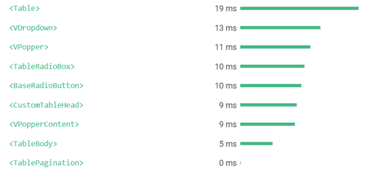
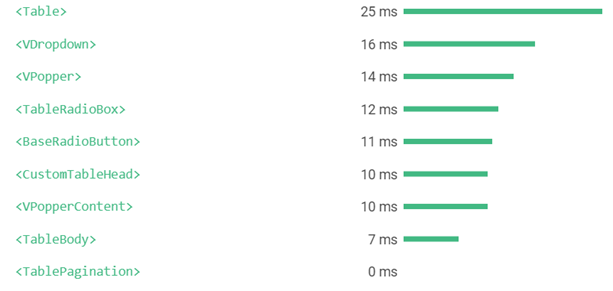
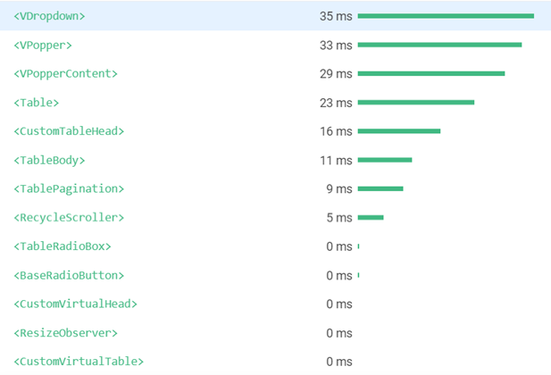
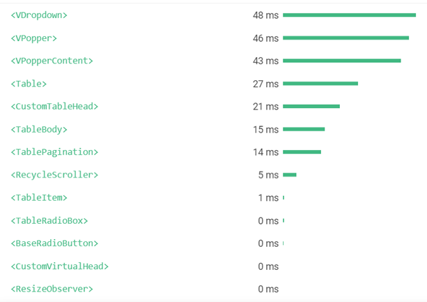
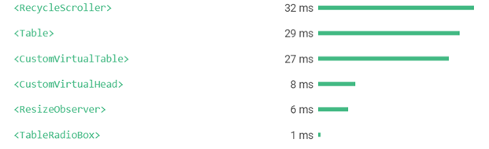
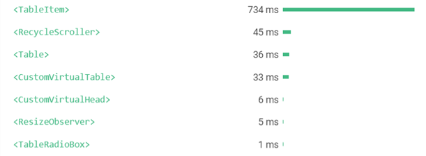

# Домашнее задание в воркшопу 6
Код, который показывал на воркшопе - https://github.com/ozon-edu-vue-2021/workshop6

## Задание
Реализовать свою таблицу по аналогии того что проходили на занятии

Требования к таблице: 
- Отображение данных
- Возможность отфильтровать данные хотя бы по одной колонке
- Возможность сортировать данные хотя бы по одной колонке
- Возможность включить пагинацию
- Возможность включить бесконечный скролл

Доп. задание (за каждый пункт доп. баллы):
- Возможность сортировать по нескольким колонкам
- Возможность фильтровать по нескольким колонкам
- Виртуальный скролл
- Написать все на функциональных компонентах (кроме мест где это невозможно)
- Провести сравнительный анализ быстродействия отрисовки данных на FC и на обычных компонентах

Дедлайн - 4 декабря

## Сравнительный анализ быстродействия отрисовки с помощью стандартных возможностей плагина Vue для Google Chrome:

(верхние графики с использованием функциональных компонентов)

### Таблица с бесконечным скроллом

### Таблица с пагинацией

### Таблица с виртуальным скроллом

